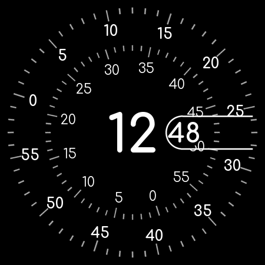

# Radial Clock — Galaxy Watch 4 watch face

A port of the [web Radial Clock](../index.html) to a real Wear OS watch face, built with
[Watch Face Format](https://developer.android.com/training/wearables/wff) (WFF).



## Why it isn't just the HTML

Wear OS watch faces have no WebView — there is no API that renders HTML/CSS/JS as a watch
face. WFF is a declarative XML format the system renders itself, which is what makes
always-on display and the power budget possible. So the design is rebuilt, not embedded.

The two tricky parts of the original translate like this:

| Web version | Watch face |
|---|---|
| 60 `<i class="spike">` per dial | one PNG per dial with all 60 ticks baked in — they rotate *with* the dial, so they don't need to be live elements |
| `.spike:after` counter-rotates each label to stay upright | one `PartText` per label with `<Transform target="angle" value="6 * [SECOND]">`, cancelling the parent `Group`'s `-6 * [SECOND]` |
| `transition: 1s linear` making the seconds dial glide | `[SECOND_MILLISECOND]` instead of `[SECOND]`, which drives a high frame rate |
| `font-weight: 900` on Comfortaa | `weight="BOLD"` — Comfortaa's axis stops at 700, so browsers were already clamping this |

## Layout

```text
watch/
  settings.gradle.kts, build.gradle.kts, gradle.properties
  tools/generate.py              <- source of truth for geometry; regenerates assets + XML
  watchface/
    build.gradle.kts
    COMFORTAA-OFL.txt            <- font license (SIL OFL 1.1)
    src/main/
      AndroidManifest.xml        <- hasCode=false, WFF format version 5
      res/raw/watchface.xml      <- GENERATED — edit generate.py, not this
      res/drawable/              <- GENERATED — ticks_seconds, ticks_minutes, pill, preview
      res/font/                  <- Comfortaa, cut to static 400/700 instances
      res/xml/watch_face_info.xml
      res/values/strings.xml
```

`res/raw/watchface.xml` and everything in `res/drawable/` are generated. To change the
design, edit the constants at the top of `tools/generate.py` and re-run it:

```powershell
python watch/tools/generate.py
```

It needs `pillow` (already installed here). `fonttools` is only needed if you re-cut the
font weights.

## Build

Nothing extra needs installing — this machine already has Android Studio (with its bundled
OpenJDK 21), the Android SDK, `adb`, build-tools 34.0.0/36.1.0, platforms android-35 and
android-36.1, and a cached Gradle 9.0.0. None of it is on `PATH`, hence the absolute paths
below.

Easiest route is **Android Studio**: `File > Open` → this `watch/` folder (not the repo
root) → let it sync → `Build > Build Bundle(s)/APK(s) > Build APK(s)`.

From the command line, this is the exact invocation that was used to build it:

```powershell
$env:JAVA_HOME = "C:\Program Files\Android\Android Studio\jbr"
$gradle = "$env:USERPROFILE\.gradle\wrapper\dists\gradle-9.0.0-bin\d6wjpkvcgsg3oed0qlfss3wgl\gradle-9.0.0\bin\gradle.bat"
cd "path\to\Clock-UI\watch"
& $gradle :watchface:assembleDebug
```

There is no Gradle wrapper checked in (the `gradle-wrapper.jar` is a binary). Android Studio
will offer to generate one; accept it and `.\gradlew` works thereafter.

Two things worth knowing if you touch the build config:

- **AGP is pinned to 8.13.2** because the installed Gradle is 9.0.0. AGP 8.7 and earlier fail
  against Gradle 9.
- **`local.properties` must not have a BOM.** PowerShell 5.1's `Out-File -Encoding utf8`
  writes one, and Java's properties parser then can't read `sdk.dir`, producing a misleading
  "SDK location not found". Write it with `-Encoding ascii`, or let Android Studio create it.

The debug APK lands in `watchface/build/outputs/apk/debug/watchface-debug.apk` (~181 KB).
It's debug-signed, which is all a sideload needs.

### Release builds

Signing material lives **outside the repository**, in `~/.radial-clock-signing/`, so that
nothing in the project tree can leak it into a commit and no editor watching the workspace
ever sees the passwords. Override the location with the `RADIAL_CLOCK_SIGNING` env var.
Without that directory the release build still succeeds — it just comes out unsigned — so a
fresh clone is not blocked.

To set it up:

```powershell
mkdir "$env:USERPROFILE\.radial-clock-signing"; cd "$env:USERPROFILE\.radial-clock-signing"
& "C:\Program Files\Android\Android Studio\jbr\bin\keytool.exe" -genkeypair -v `
    -keystore radial-clock.jks -alias radialclock -keyalg RSA -keysize 4096 -validity 10000
```

Then `keystore.properties` beside it, written with `-Encoding ascii` — PowerShell 5.1's
default `utf8` adds a BOM that Java's properties parser cannot read, which surfaces as a
misleading "SDK location not found":

```
storeFile=radial-clock.jks
storePassword=...
keyAlias=radialclock
keyPassword=...
```

**Back the `.jks` up somewhere safe.** Losing it is worse than leaking it: without it you
cannot ship an update that installs over an existing copy, and every user would have to
uninstall and re-add the face.

Then `gradle :watchface:assembleRelease`. Verify what you actually built before shipping it:

```powershell
& "$env:LOCALAPPDATA\Android\Sdk\build-tools\36.1.0\apksigner.bat" verify --print-certs `
    watchface\build\outputs\apk\release\watchface-release.apk
```

It must **not** say `CN=Android Debug`. A release APK cannot install over a debug one —
signatures differ, and you get `INSTALL_FAILED_UPDATE_INCOMPATIBLE` — so uninstall first.

## Install on the Galaxy Watch 4

**Enable developer mode on the watch** (already done on this watch)

1. Settings → About watch → Software info → tap **Software version** seven times.
2. Settings → Developer options → turn on **ADB debugging** and **Wireless debugging**.

**Connect**

Wear OS 6 uses paired wireless debugging:

```powershell
# Developer options > Wireless debugging > Pair new device  (gives an IP:port and a 6-digit code)
adb pair 192.168.1.x:xxxxx

# Developer options > Wireless debugging  (shows a different IP:port for the connection)
adb connect 192.168.1.x:xxxxx
adb devices
```

Keep the watch and PC on the same Wi-Fi, and keep the Wireless debugging screen open while
pairing. Accept the "Allow debugging?" prompt on the watch.

**Install**

```powershell
& "$env:LOCALAPPDATA\Android\Sdk\platform-tools\adb.exe" install -r `
    watchface\build\outputs\apk\debug\watchface-debug.apk
```

Or straight from Gradle: `gradle :watchface:installDebug`.

**Select it**, either on the watch — long-press the current face → swipe to the end →
**Add watch face** → **Radial Clock** — or over adb:

```powershell
& "$env:LOCALAPPDATA\Android\Sdk\platform-tools\adb.exe" shell am broadcast `
    -a com.google.android.wearable.app.DEBUG_SURFACE `
    --es operation set-watchface `
    --es watchFaceId com.gilmorecollins.radialclock
```

A successful call replies `result=1, data="Favorite Id=[n] Runtime=[2]"`. Pass **only**
`watchFaceId` — a declarative face has no class name of its own, so adding `--ecn component`
gets you either "Both component name and watchface id are specified" or "Class name cannot
be a placeholder".

## Notes

- **The seconds dial glides, and there is a trick keeping it fluid.** By default the runtime
  presents a watch face at a flat **10.0 fps** — a dead-regular 100 ms cadence on a 60 Hz
  panel, even though a frame costs only 15–34 ms to draw. That throttle is what makes a
  continuously rotating dial look choppy, and it is not something you can optimise away:
  deleting all 24 dial labels made each frame 38% cheaper and left the rate at 10 fps.

  `<Sweep>` is the only explicit frame-rate request in the format, and it is defined for
  `AnalogClock` hands rather than `Group`s. So the face carries an **invisible swept second
  hand** (`alpha="0"`) that draws nothing and exists purely as a hint — and the rate it
  unlocks applies to the whole surface, so the dials and labels ride along.

  Measured with `dumpsys SurfaceFlinger --latency` on the wallpaper layer, screen on:

  | build | fps | p50 gap | janky |
  |---|---|---|---|
  | no hint | 10.0 | 100 ms (flat) | 0% |
  | `Sweep frequency="15"` | 20.2 | 50 ms | 0% |
  | `Sweep frequency="60"` | **24.6** | 33 ms | 0% |

  At `60` many frames land on a single vsync and the median frame time drops to 15 ms,
  because the CPU stays clocked up instead of idling between frames. Note the rate is *not*
  capped at the `frequency` value — 15 yielded 20 fps.

  Toggles in `tools/generate.py`: `FRAME_RATE_HINT = False` restores the stock 10 fps;
  `SECONDS_SOURCE = "SECOND"` replaces the glide with a 1 Hz step, which is cheapest of all
  but loses the radial motion the design is built around. **Neither is worth doing for
  battery** — see below.

- **Battery: the glide is not the problem.** Measured over 5h 40m of ordinary wear with AOD
  on, 95% → 57% (91.7 mAh of a 240 mAh cell):

  | | mAh | share |
  |---|---|---|
  | watch face runtime (`com.samsung.wear.watchface.runtime`) | 2.56 | 2.8% |
  | `ambient_display` (the AOD panel) | 25.8 | 28% |
  | system (UID 1000) | 8.61 | 9.4% |

  `Screen on discharge: 0 mAh. Screen doze discharge: 91.7 mAh.` The screen was on for
  13m 13s of 5h 40m (3.9%) across 161 wrist raises — ~5s per glance — and *interactive*
  time, when the 24.6fps glide actually runs, was 3m 11s (0.9%). Total discharged while
  the screen was on: 1%, against 38% overall.

  So the frame-rate hint costs on the order of 1% of battery over a working day's wear.
  The dominant cost is the AOD panel being lit at all, and at 2.04% mean luminance our
  emission is a small part of that — dimming the face would recover very little. Projected
  life is ~15h from full with AOD on; the real lever is AOD itself, not this watch face.

  Read it again with: `adb shell dumpsys batterystats`, then find the UID of
  `com.samsung.wear.watchface.runtime` via `adb shell pm list packages -U` (it renders the
  face; the `radialclock` package itself is inert and will look idle).
- **Always-on display.** Ambient keeps the whole minutes dial — ticks *and* labels — at
  alpha 160, with the readouts at 230, so the radial design survives on the AOD. Only the
  seconds dial goes dark, and that is for correctness rather than power: ambient refreshes
  once a minute, so a seconds dial would sit frozen on a stale value.

  The quality bar (WO-P7) is 15% **mean luminance** across the face, not a count of lit
  pixels. This design is nearly all black, so the numbers are not close: the full
  interactive face is 4.46%, and ambient as configured is **2.63%**. There is no power
  argument for hiding anything else — tune `AMBIENT_DIAL_ALPHA` / `AMBIENT_TEXT_ALPHA` in
  `generate.py` freely.

  Verified on-device: with the watch worn, `mScreenState=DOZE` and the face measures
  **2.04%** mean luminance. The screen only enters AOD when worn — there is no adb command
  to force it, so this cannot be checked with the watch sitting on a desk.

- **Burn-in protection is ours to do; the system does not do it.** Two AOD frames 75s apart
  put the hour glyphs on *pixel-identical* coordinates (0.00px drift), and the frames
  genuinely differed elsewhere — 5,899 pixels changed across the minute dial — so the
  capture was live, not a stale buffer. Neither the WFF ambient docs nor the quality
  guidelines mention pixel shifting at all.

  So `burn_in_drift` wraps the whole face and nudges it around a 5×5 one-pixel lattice, one
  step per minute:

  ```xml
  <Transform target="x" value="[MINUTE] % 5 - 2" />
  <Transform target="y" value="floor([MINUTE] / 5) % 5 - 2" />
  ```

  Integer modular arithmetic rather than `sin`/`cos` on purpose: the docs never say whether
  WFF's trig takes degrees or radians, and this needs no such assumption. Measured after the
  change, consecutive minutes move the hour by 0.75px on the 396px screen — one design unit
  — while y correctly holds still until the 5-minute step. Set `BURN_IN_DRIFT = False` to
  disable.
- **Hour format** follows the watch's own 12/24-hour setting via
  `[IS_24_HOUR_MODE] ? [HOUR_0_23] : [HOUR_1_12]`. The web version was hardcoded to 24-hour.
- **Format version must stay at 1** on this watch. Declaring `5` builds and installs fine,
  but Samsung's runtime silently never registers the package as a declarative watch face, so
  it never reaches the picker — no error anywhere, it simply isn't listed. The tell is in
  logcat: a working face logs
  `WCSExt: [PackageEventHandler] dwf watchface Info [<package>]` on install, and with
  version 5 that line is absent. Every declarative face preinstalled on the device
  (`com.samsung.sree.*`) declares version 1. This is why the labels use plain
  `<Text align="CENTER">` and not `verticalAlign`, which is a v5 feature — text centres
  vertically in its box by default anyway, so nothing was lost.
- **Keep `watch_face_info.xml` minimal.** `<Preview>` is the only required element, and an
  unrecognised value in an optional one is another way to get silently dropped from the
  picker.
- **Screen sizes.** The face is designed on the standard 450×450 canvas and WFF scales it to
  the physical display, so both the 40mm and 44mm Watch 4 are covered.

## Third-party

Comfortaa by the Comfortaa Project Authors, SIL Open Font License 1.1 — see
[`watchface/COMFORTAA-OFL.txt`](watchface/COMFORTAA-OFL.txt). The bundled TTFs are static 400
and 700 instances cut from the upstream variable font.
